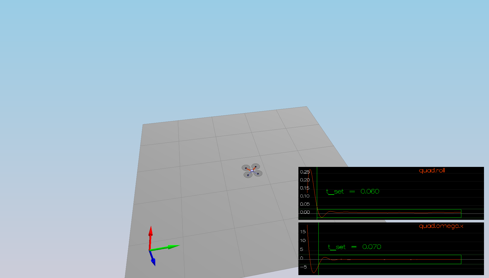
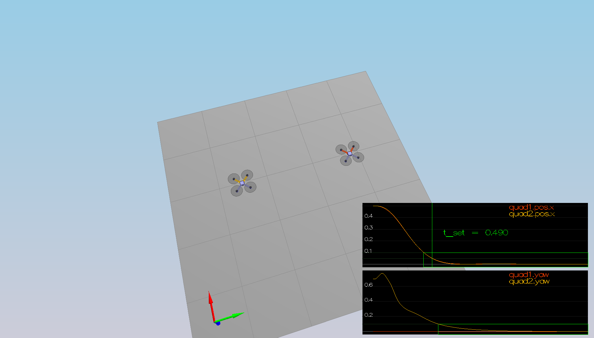
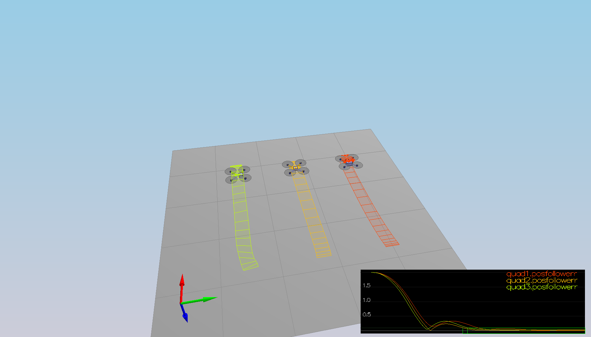
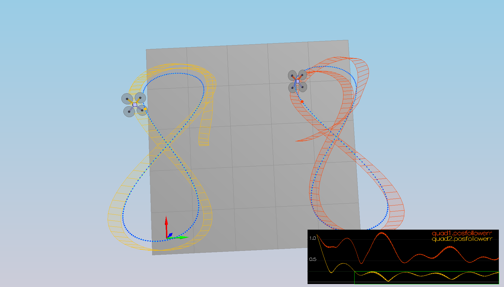

## Project: Control of a 3D Quadrotor

### Writeup / README

#### 1. Provide a Writeup / README that includes all the rubric points and how you addressed each one.  You can submit your writeup as markdown or pdf.  

You're reading it! Below I describe how I addressed each rubric point and where in my code each point is handled.

### Testing it Out

#### 1. Tune the Mass parameter in QuadControlParams.txt to make the vehicle more or less stay in the same spot.
I tuned Mass parameter as 0.52.

### Body rate and roll/pitch control (scenario 2)

#### 1. Implement body rate control 
I implemented the code in the function GenerateMotorCommands() as shown as below.
```
  float sums[4];

  sums[0] = collThrustCmd;
  sums[1] = momentCmd.x / (L/sqrt(2.f));
  sums[2] = momentCmd.y / (L/sqrt(2.f));
  sums[3] = momentCmd.z / kappa;

  cmd.desiredThrustsN[0] = 0.25f * (sums[0] + sums[1] + sums[2] - sums[3]); // front left
  cmd.desiredThrustsN[1] = 0.25f * (sums[0] - sums[1] + sums[2] + sums[3]); // front right
  cmd.desiredThrustsN[2] = 0.25f * (sums[0] + sums[1] - sums[2] + sums[3]); // rear left
  cmd.desiredThrustsN[3] = 0.25f * (sums[0] - sums[1] - sums[2] - sums[3]); // rear right
```
I implemented P controller the code as shown below in the function BodyRateControl()
```
  V3F err, u_bar, inertia(Ixx,Iyy,Izz);

  err = pqrCmd - pqr;
  u_bar = kpPQR * err;
  momentCmd = u_bar * inertia;
```

I tuned P and Q params in QuadControlParams.txt
```
kpPQR = 82, 82, 5
```


#### 2. Implement roll / pitch control

implement the code in the function RollPitchControl()
```
  V3F b_c, b_c_dot;

  b_c = -accelCmd / (collThrustCmd / mass);

  b_c_dot.x = kpBank * (b_c.x - R(0,2));
  b_c_dot.y = kpBank * (b_c.y - R(1,2));

  pqrCmd[0] = (R(1,0)*b_c_dot.x - R(0,0)*b_c_dot.y) / R(2,2);
  pqrCmd[1] = (R(1,1)*b_c_dot.x - R(0,1)*b_c_dot.y) / R(2,2);
  pqrCmd[2] = 0.f;
```

Tune kpBank in QuadControlParams.txt
```
kpBank = 16
```


### Position/velocity and yaw angle control (scenario 3)
implement the code in the function LateralPositionControl()
```
  V3F velCmdFilt;

  velCmdFilt = kpPosXY * (posCmd - pos) + velCmd;

  velCmdFilt.x = CONSTRAIN(velCmdFilt.x, -maxSpeedXY, maxSpeedXY);
  velCmdFilt.y = CONSTRAIN(velCmdFilt.y, -maxSpeedXY, maxSpeedXY);

  accelCmd = kpVelXY * (velCmdFilt - vel) + accelCmdFF;

  accelCmd.x = CONSTRAIN(accelCmd.x, -maxAccelXY, maxAccelXY);
  accelCmd.y = CONSTRAIN(accelCmd.y, -maxAccelXY, maxAccelXY);
```

implement the code in the function AltitudeControl()
```
  float u_1_bar, velZCmdFilt;

  velZCmdFilt = kpPosZ * (posZCmd - posZ) + velZCmd;
  velZCmdFilt = CONSTRAIN(velZCmdFilt, -maxAscentRate, maxDescentRate);

  u_1_bar = kpVelZ * (velZCmdFilt - velZ) + accelZCmd;

  thrust = -(u_1_bar - 9.81) * mass / R(2,2);
```

tune parameters kpPosXY and kpPosZ
tune parameters kpVelXY and kpVelZ
```
kpPosXY = 3.5
kpPosZ = 3

kpVelXY = 8
kpVelZ = 8
```

implement the code in the function YawControl()
```
  float err = 0;
  err = fmodf(yawCmd - yaw, 2.0 * F_PI);

  if(err > F_PI)
      err -= 2.0 * F_PI;
  else if(err < -F_PI)
      err += 2.0 * F_PI;

  yawRateCmd = kpYaw * err;
```

tune parameters kpYaw and the 3rd (z) component of kpPQR
```
kpYaw = 3
kpPQR = 82, 82, 15

```



### Non-idealities and robustness (scenario 4)

I added limiting lines to RollPitchControl.
```
  V3F b_c, b_c_dot;

  b_c = -accelCmd / (collThrustCmd / mass);

  b_c.x = CONSTRAIN(b_c.x, -maxTiltAngle, maxTiltAngle);
  b_c.y = CONSTRAIN(b_c.y, -maxTiltAngle, maxTiltAngle);

  b_c_dot.x = kpBank * (b_c.x - R(0,2));
  b_c_dot.y = kpBank * (b_c.y - R(1,2));

  if (collThrustCmd < 0)
  {
    b_c_dot.x = 0;
    b_c_dot.y = 0;
  }

  pqrCmd[0] = (R(1,0)*b_c_dot.x - R(0,0)*b_c_dot.y) / R(2,2);
  pqrCmd[1] = (R(1,1)*b_c_dot.x - R(0,1)*b_c_dot.y) / R(2,2);
  pqrCmd[2] = 0.f;
```

Edit AltitudeControl() to add basic integral control to help with the different-mass vehicle.
```
  integratedAltitudeError += (posZCmd - posZ) * dt;

  u_1_bar = kpVelZ * (velZCmdFilt - velZ) + KiPosZ * integratedAltitudeError + accelZCmd;
```

Tune the integral control
```
KiPosZ = 50
```

### Tracking trajectories 


